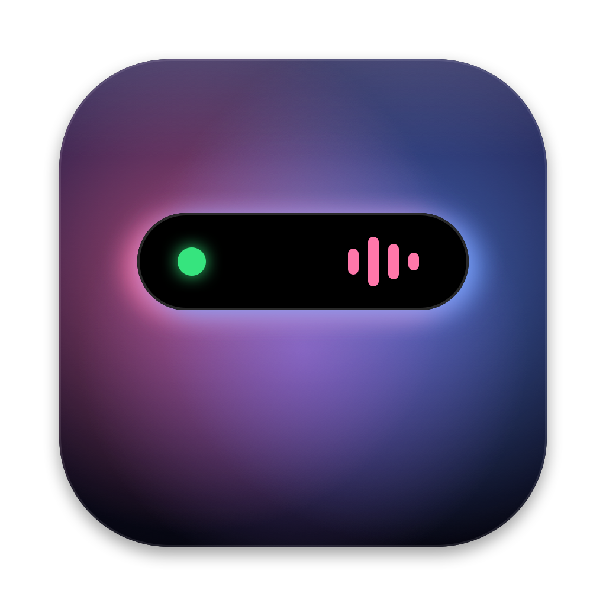

<p align="center">
  
</p>

<h1 align="center">Mac Dynamic Island</h1>

<p align="center">
  A Dynamic Island for the MacBook notch — written in Python with PyObjC.
</p>

<p align="center">
  <a href="https://github.com/TonyD365/Mac-Dynamic-Island/actions/workflows/ci.yml"></a>
  <a href="https://github.com/TonyD365/Mac-Dynamic-Island/releases/latest"></a>
</p>

---

Dynamic Island sits around the camera on your Mac's built-in display. When nothing is happening it
shows the time and battery beside the notch. When something does happen, it springs open to tell you.
Click it for a ring of action buttons.

## Features

**Live information**
- Clock, date, battery and CPU / memory at a glance
- Green and orange dots when an app is using the camera or microphone
- Now playing from any app — music players and browser videos alike — with play / pause, skip and a
  progress bar you can drag to seek
- Volume and brightness bar when you press the keys
- Alerts when a Bluetooth device connects or disconnects, and when you plug in or unplug power
- A welcome animation when you log in or unlock

**Action ring** — click the island, then scroll to turn the ring
- Focus, Mute, Dark Mode, Keep Awake, Lock Screen, Sleep Display
- Screenshot to clipboard, Color Picker, Downloads, Activity Monitor, Calculator
- Your own **custom buttons**: open an app, a file or folder, a website, or run a shell command
- Scroll on the island itself to change the volume

**Focus modes**
- Named modes with their own default length; you are asked how long each time you start one
- **Blacklist** — block the listed apps and websites
- **Whitelist** — block everything except the listed apps and websites
- Optional "can't be stopped early" per mode
- The island itself is never blocked

**Everything else**
- Stays visible on the lock screen
- Background pictures for the expanded island: built-in macOS landscapes or your own image
- Launch at login
- Updates itself from this repository's releases
- Works on Macs with and without a notch, on Apple silicon and Intel

## Install

1. Download the `.pkg` from the [latest release](https://github.com/TonyD365/Mac-Dynamic-Island/releases/latest).
2. Open it. macOS will refuse the first time, because the installer is not signed with an Apple
   Developer ID.
3. Open **System Settings → Privacy & Security**, scroll down and click **Open Anyway**.
4. Finish the installer. Dynamic Island is installed in `/Applications` and starts by itself.

Requires macOS 12 or later.

### Permissions

macOS asks for these the first time the matching feature is used:

| Permission | Used for |
|---|---|
| Automation (System Events) | The Dark Mode button |
| Automation (your browser) | Website blocking during a focus mode |
| Screen Recording | The Screenshot button |

The camera and microphone are never opened: the island only asks the system whether another app is
using them.

## Updates

A released app checks this repository for the release marked **Latest**. When it carries a higher
version number, the app tells you, downloads the installer, verifies its SHA-256 checksum and opens
it. The installer quits the old copy and starts the new one.

- Turn automatic updates off in **Settings → Automatic Updates**.
- **Settings → Check for Updates** shows the installed version and checks immediately.
- Updates wait while a focus session is running or the screen is locked.

## Development

### Run from source

```bash
python3 -m venv .venv
.venv/bin/pip install -r requirements.txt
.venv/bin/python src/main.py
```

Start it from a normal terminal session so macOS will show its window. A build run from source
reports version `0.0.0` and never updates itself.

To try the layout used on Macs without a notch:

```bash
DI_FAKE_NO_NOTCH=1 .venv/bin/python src/main.py
```

### Build

```bash
./build.sh
```

Produces `dist/Dynamic Island.app` and `dist/Dynamic Island.pkg`, each containing both `arm64` and
`x86_64`. The universal build needs a universal2 Python, such as the installer from python.org.

### Tests and benchmark

```bash
.venv/bin/python -m unittest discover -s tests -v
.venv/bin/python tools/benchmark.py
```

The tests cover the logic that needs no screen or permissions: version comparison and the updater's
choices, focus-mode blocking rules, settings, and the parsing of system readings. The benchmark times
the main loop and every background reading and estimates the island's idle load.

Every pull request runs the **CI** workflow: the tests, a benchmark of the PR against its base branch
(posted as a comment on the PR), and a full universal build that also starts the built app once.

### Release

1. Commit and push to `main`.
2. On GitHub, publish a release whose tag is `v` followed by the version number, for example `v1.2.3`.
3. The **Release** workflow stamps that version into the app, builds the installer and attaches
   `Dynamic-Island-1.2.3.pkg` and `Dynamic-Island-1.2.3.pkg.sha256` to the release.

Installed apps update once the release is marked **Latest** and the files are attached. Drafts and
pre-releases are ignored.

### Layout

```
src/                 the app
  main.py              entry point
  island.py            window, layers, animation, interaction
  screen.py            finds the built-in display and the notch
  monitors.py          camera, microphone, audio, brightness, battery, Bluetooth, system stats
  actions.py           quick actions behind the ring buttons
  focus.py             focus modes and blocking
  focus_panel.py       the drop-down under the Focus button
  focus_editor.py      the Focus Modes window
  custom_buttons.py    custom buttons and their window
  backgrounds.py       background pictures
  lockscreen.py        lock-screen display
  autostart.py         launch at login
  updater.py           self-update from GitHub releases
  settings.py          saved settings
  version.py           version number, stamped by the release workflow
assets/              app icon
packaging/           installer scripts and the icon generator
tests/               logic tests
tools/               benchmark
.github/workflows/   CI for pull requests, and the release build
build.sh, setup.py   build the universal app and installer
```

Settings are stored in `~/Library/Application Support/DynamicIsland/settings.json`.

## Limitations

- **Unsigned.** There is no Apple Developer ID signature or notarization, hence the extra step when
  installing.
- **Private interfaces.** Lock-screen display, system-wide Now Playing, reading the display brightness
  and the Lock Screen button rely on undocumented macOS interfaces and may stop working after a system
  update. If Now Playing stops answering, the island falls back to asking Music and Spotify directly.
- **Focus blocking is a nudge, not a lock.** Blocked apps are hidden, not quit. Blocked pages are
  replaced only in Safari, Chrome, Edge, Brave and Arc, about a second after they load.
  Force-quitting Dynamic Island lifts all blocking.
- **Not shown before login.** macOS does not run user apps on the login screen at startup; the
  island appears once you log in.
- Bluetooth alerts poll once a second, so a device that drops and reconnects faster than that is
  missed.
